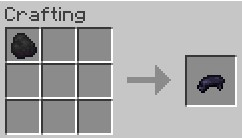
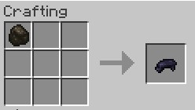
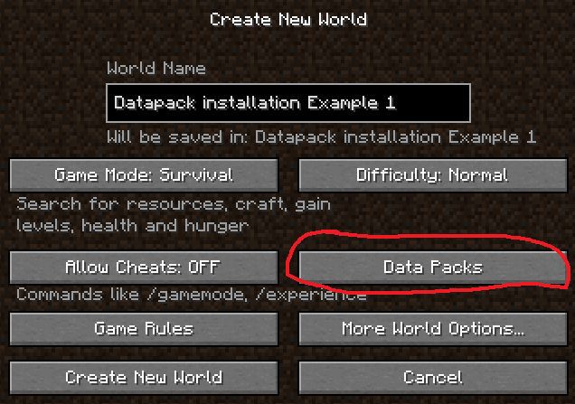
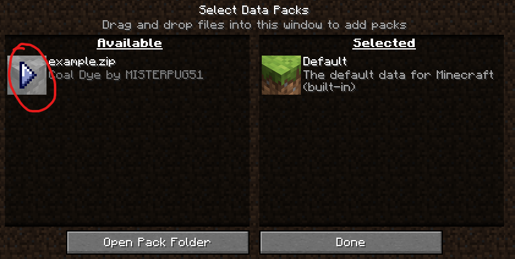

# CoalDye
[View on modrinth.com](https://modrinth.com/datapack/coaldye)
 
[View on planetminecraft.com](https://www.planetminecraft.com/data-pack/coaldye/)

### What is CoalDye?
CoalDye is a datapack for Minecraft Java Edition. This datapack lets you craft black dye using coal or charcoal. Without this datapack, you can only craft black dye with [ink sacs](https://minecraft.wiki/w/Ink_Sac) and [wither roses](https://minecraft.wiki/w/Wither_Rose).
### Crafting Recipes

### How do I install it?
There are a few ways you can add a datapack to your world.
 
If you are on version 1.16 or newer and you have not created your world yet, use method 1.
 
If you are using version 1.16 or newer and want to add this datapack to an already existing world, use method 2.
 
If you are using a version older than 1.16, use method 2.
##### Method 1 :
1. In the world creation menu, click "Data Packs". 

2. Drag and drop the downloaded file into the left section of the Select Data Packs Menu. You do not need to unzip the datapack.
4. Move the mouse over the datapack in the "Available" section of the Select Data Packs Menu and click the right facing arrow. 

5. You have successfully added the datapack to your world. Click "Done" to return to the world creation settings.
##### Method 2:
1. Open your .minecraft folder. If you don't know how to do this, see [this page](https://minecraft.fandom.com/wiki/.minecraft#Locating_.minecraft)
2. Once you are in the .minecraft folder, locate the "saves" folder and open it.
3. In the saves folder, locate the folder for the world you want to add the datapack to. Once you find it, open the folder.
4. Once you are in your world folder, open the "datapacks" folder. If it does not exist, you can create it. Make sure you name it "datapacks" with no capital letters.
5. Copy and paste the datapack file into this folder. You do not need to unzip the datapack.
6. Reload your Minecraft world.
